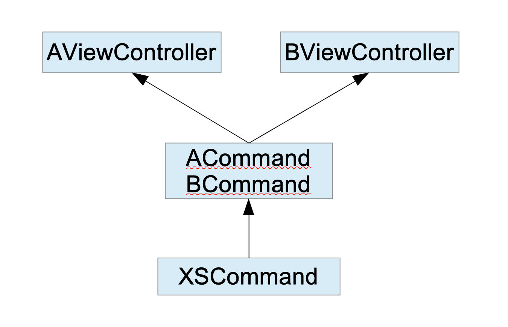

# XSCommand

以命令模式设计的中介者，用于模块间解藕，也可用作控制器解藕。



## 举例

-  **ViewController**

``` objc
@interface ViewController : UIViewController
@end
```

-  **TestViewController**

``` objc
@interface TestViewController : UIViewController
@property (nonatomic) UIColor *bgColor;
@end
```

## 简单使用

使用时，属性名相同即可，例如TestViewController.bgColor <--> TestCommand.bgColor。


### 1.  使用Storyboard方式

实现XSCommandStoryboard协议，并提供storyboardName

-  **TestCommand**

``` objc
@interface TestCommand : XSCommand <XSCommandStoryboard>
@property (nonatomic) UIColor *bgColor;
@end
```

``` objc
@implementation TestCommand
@synthesize storyboardName;

- (instancetype)init
{
    self = [super init];
    if (self) {
        self.storyboardName = @"Main";
        self.className = @"TestViewController";
    }
    return self;
}

@end
```

### 2.  使用Nib方式

实现XSCommandNib协议

-  **TestCommand**

``` objc
@interface TestCommand : XSCommand <XSCommandNib>
@property (nonatomic) UIColor *bgColor;
@end
```

``` objc
@implementation TestCommand

- (instancetype)init
{
    self = [super init];
    if (self) {
        self.className = @"TestViewController";
    }
    return self;
}

@end
```

### 3.  使用Code方式

实现XSCommandNib协议

-  **TestCommand**

``` objc
@interface TestCommand : XSCommand
@property (nonatomic) UIColor *bgColor;
@end
```

``` objc
@implementation TestCommand

- (instancetype)init
{
    self = [super init];
    if (self) {
        self.className = @"TestViewController";
    }
    return self;
}

@end
```

### 调用

``` objc
TestCommand *c = [TestCommand new];
c.bgColor = [UIColor redColor];
[self presentViewController:[c command] animated:YES completion:nil];
```

## 高级使用 

如果属性名不相同，或者有自定义的初始化方法，需要在TestViewController模块中写个TestCommand分类，重写-command方法。


-  **TestViewController.h**

``` objc
@interface TestViewController : UIViewController

@property (nonatomic) UIColor *bgColor;
@property (nonatomic) NSString *title_name;

- (instancetype)initWithA:(NSInteger)a B:(NSInteger)b;

@end
```

-  **TestCommand**

``` objc
@interface TestCommand : XSCommand
@property (nonatomic) UIColor *bgColor;
@property (nonatomic) NSString *titleName;
@end
```

``` objc
@implementation TestCommand

- (instancetype)init
{
    self = [super init];
    if (self) {
        self.className = @"TestViewController";
    }
    return self;
}

@end
```

-  **TestViewController.m**

在此模块中写个TestCommand分类，并重写-command方法

``` objc
#import "TestCommand.h"

@interface TestCommand (Test)
@end

@implementation TestCommand (Test)

- (__kindof UIViewController *)command {
    TestViewController *vc = [[TestViewController alloc] initWithA:2 B:3];
    vc.bgColor = self.bgColor;
    vc.title_name = self.titleName;
    return vc;
}

@end
```

``` objc
@interface TestViewController ()
@property (nonatomic) NSInteger a;
@property (nonatomic) NSInteger b;
@end

@implementation TestViewController

- (instancetype)initWithA:(NSInteger)a B:(NSInteger)b {
    self = [super initWithNibName:nil bundle:nil];
    if (self) {
        self.a = a;
        self.b = b;
    }
    return self;
}

- (void)viewDidLoad {
    [super viewDidLoad];
    self.view.backgroundColor = self.bgColor;
    printf(">>> %s\n", self.title_name.UTF8String);
    printf(">>> a = %ld, b = %ld\n", self.a, self.b);
}

@end
```

### 调用

``` objc
TestCommand *c = [TestCommand new];
c.bgColor = [UIColor redColor];
c.titleName = @"ABC";
[self presentViewController:[c command] animated:YES completion:nil];
```

## 问题

### 关于业务模型的引用

如果ACommand、BCommand层没有引用业务模型，那么在ACommand、BCommand层中需要将具体业务模型类型改为id类型

``` objc
@interface TestCommand : XSCommand <XSCommandStoryboard>
@property (nonatomic) UIColor *bgColor;
@property (nonatomic) id person;
@end
```

### 关于回调

一般来说，模块（或控制器）之间是不需要回调的，如果有，采用block形式。

如果ACommand、BCommand层没有引用业务模型，那么在ACommand、BCommand层中需要将具体业务模型类型改为id类型

``` objc
@interface TestCommand : XSCommand <XSCommandStoryboard>
@property (nonatomic) UIColor *bgColor;
@property (nonatomic) void (^callback)(id model);
@end
```
